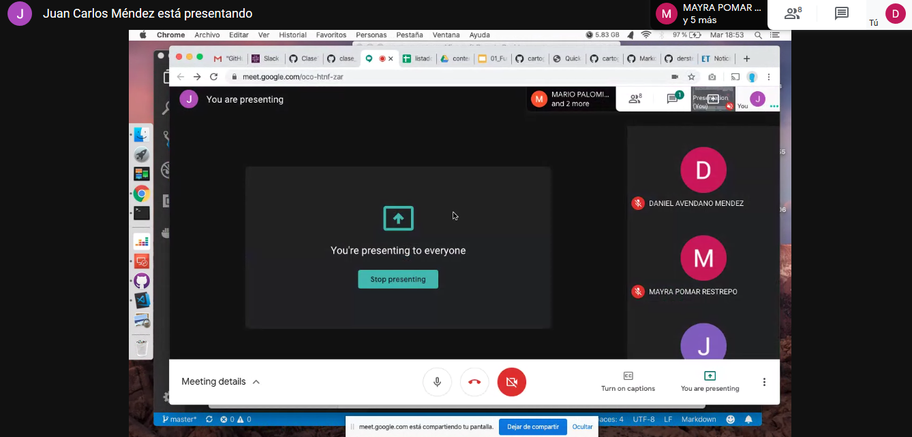

# Clase1_Cartografia_Web
Repositorio para uso de clase virtual de Cartografia Web

Ejemplo Clase

## Titulos de segundo nivel

ejemplo clase dos 

* Lista 1
* Lista 2
* Lista 3

 ## Tierra
 
 Planeta Tierra
 

## Colombia

Colombia 

## Clase

### Autor

Daniel 

