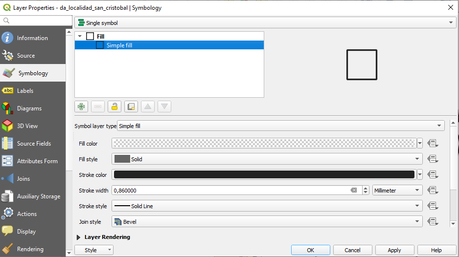

## 1. Definicion del problema

* El problema a solucionar es encontrar las manzanas en la localidad de San Cristobal las cuales se encuentran a mas de 200 metros de un paradero del SITP, y con esto garantizar que todas las manzanas tengan un paradero a por lo menos 200 metros lo que le tomaria a una persona promedio llegar caminando al paradero entre 2 y 3 minutos teniendo en cuenta que la velocidad de una persona adulta al caminar son 83 metros por minuto.

* Se propone:
- Extraer los datos de la capa localidades para tener solamente la localidad de San Cristobal
- Extraer los paraderos del sitp que se encuentran en la localidad de San Cristobal
- Realizar un Intersect para determinar las manzanas que se encuentran en la localidad de San Cristobal
- Realizar un Buffer a los paraderos del Sitp, para calcular su area de cobertura.
- Realizar una consulta por localizacion para determinar cuales manzanas no tienen cobertura de los paraderos del SITP en San Cristobal

## 2. Fuente de datos

* Localidades

* Manzanas

* Paraderos del SITP

## 3. Procesamiento de datos

Para procesar los datos se va a usar la herramienta postgres, como el ejercicio que voy a trabajar solo necesita datos de una localidad entonces se procedio a realizar una base de datos diferente para trabajar los datos, y despues si cargarlos a la destinada para la clase.

* Primero se debe crear la base de datos

* se verifica y la extension de postgis no esta activa

* se procede a activar la extension de postgis

* para cargar los datos a la base de datos debemos hacer uso de la herramienta QGIS, primero se debe hacer la conexion a la base de datos, en la ventana "Browser" damos click derecho a la opcion "PosGIS" y se despliega una herramienta que dice "New Connection..." esto despliega una ventana que nos permitira conectar a la base de datos anteriormente creada y se llena de la siguiente manera

* posteriormente cargamos las capas que vamos a utilizar en el ejercicio seleccionamos la pestaña "Database" y la opcion "DB Manager..." y se tiene la siguiente ventana, ahi nos aseguramos de conectarnos a la base de datos de interes

* en la ventana de "DB Manager" se selecciona el boton "Import/Layer File..." y se importan las tres capas de la siguiente manera

* ya se puede trabajar desde la base de datos creada anteriormente
* como se requiere hacer solo el analisis de la localidad de San Cristobal, se procede a extraer esa localidad y que nos cree una nueva tabla con solo esa localidad.

* para los paraderos del sitp tambien extraemos los datos que se encuentran unicamente en la localidad de San Cristobal, y se crea una nueva tabla con estos paraderos.

* para las manzanas tambien extraemos unicamente las que se encuentran en la localidad de San Cristobal, como la capa de manzanas no cuenta con el atributo localidad se hace uso de la funcion intersects y se crea una nueva tabla con esas manzanas

* Se realizo un buffer de 200 metros a cada paradero de sitp en la localidad de San Cristobal, y tambien se realizo una union para que solo se tuviera un poligono resultante, y se le calculo el area de la siguiente manera.

* se obtiene que los paraderos del sitp de la localidad de San Cristobal, tienen una area de influencia de 14455512,617306 metros cuadrados 

* se procedio a calcular cuales manzanas se encontraban fuera de la cobertura del area de influencia.

* y se muestran a continuacion en color rojo

* tambien se calculo cuales manzanas no se suplia totalmente la cobertura del area de influencia de 200 metros.

* y se muestran a continuacion en color amarillo

#### Cargar capas a GEOSERVER

* se selecciona la pestaña "Database" y la opcion "DB Manager..." y se tiene la siguiente ventana, ahi nos aseguramos de conectarnos a la base de datos del curso

* en la ventana de "DB Manager" se selecciona el boton "Import/Layer File..." y se importan las capas de la siguiente manera:
- capa da_paraderos_sitp_san_cristobal

- capa da_manzanas_sin_cobertura_completa

- capa da_manzanas_sin_cobertura

- capa da_buffer_200_paraderos

- capa da_manzanas_san_cristobal

- capa da_localidad_san_cristobal

* en la ruta del geoserver se da click en el boton "Capas" ubicado en Datos y se le da la opcion de agragar nuevo recurso.

* se selecciona la base de datos 

* y se escoje la capa que se va a publicar y se le ajustan los datos de la siguiente manera

* ese proceso se realiza con todas las capas que se requieren publicar
* se hace la verificacion de que las capas esten publicadas

## 4. Capa simbología SLD

* Para crear la simbologia en formato SLD se debe tener la capa desplegada en QGIS, y se le da click derecho y la opcion "Properties..."
* se ajusta la simbologia de la manera adecuada

* se presiona el boton "Style" y se despliega una barra de opciones se debe seleccionar "Save Style..." 

* para cargar el estilo al Geoserver, se da click en el boton estilos, y en el boton agregar un nuevo estilo
* se introducen los datos de las siguiente manera

* se realizo para la capa "da_localidad_san_cristobal"
* se introduce el codigo 
~~~
  <NamedLayer>
    <se:Name>da_localidad_san_cristobal</se:Name>
    <UserStyle>
      <se:Name>da_localidad_san_cristobal</se:Name>
      <se:FeatureTypeStyle>
        <se:Rule>
          <se:Name>Localidad San Cristobal</se:Name>
          <se:PolygonSymbolizer>
            <se:Fill>
              <se:SvgParameter name="fill">#91522d</se:SvgParameter>
              <se:SvgParameter name="fill-opacity">0</se:SvgParameter>
            </se:Fill>
            <se:Stroke>
              <se:SvgParameter name="stroke">#232323</se:SvgParameter>
              <se:SvgParameter name="stroke-width">3</se:SvgParameter>
              <se:SvgParameter name="stroke-linejoin">bevel</se:SvgParameter>
            </se:Stroke>
          </se:PolygonSymbolizer>
        </se:Rule>
        <se:Rule>
          <se:TextSymbolizer>
            <se:Label>
              <ogc:PropertyName>locnombre</ogc:PropertyName>
            </se:Label>
            <se:Font>
              <se:SvgParameter name="font-family">MS Shell Dlg 2</se:SvgParameter>
              <se:SvgParameter name="font-size">13</se:SvgParameter>
            </se:Font>
            <se:LabelPlacement>
              <se:PointPlacement>
                <se:AnchorPoint>
                  <se:AnchorPointX>0</se:AnchorPointX>
                  <se:AnchorPointY>0.5</se:AnchorPointY>
                </se:AnchorPoint>
              </se:PointPlacement>
            </se:LabelPlacement>
            <se:Fill>
              <se:SvgParameter name="fill">#000000</se:SvgParameter>
            </se:Fill>
            <se:VendorOption name="maxDisplacement">1</se:VendorOption>
          </se:TextSymbolizer>
        </se:Rule>
      </se:FeatureTypeStyle>
    </UserStyle>
  </NamedLayer>
</StyledLayerDescriptor>
~~~
* previsualizacion de la leyenda

* previsualizacion de la capa

* se realizo para la capa "da_paraderos_sitp_san_cristobal"
* codigo
-- codigo sld
* previsualizacion de la leyenda

* previsualizacion de la capa

* se realizo para la capa "da_buffer_200_paraderos"
* se introduce el codigo 
-- codigo sld
* previsualizacion de la leyenda

* previsualizacion de la capa

## 5. Capa simbología CSS

* Para crear la simbologia en CSS debemos acceder a la pagina de geoserver y en la pestaña estilos agregar uno nuevo, se llenan los campos como acontinuacion y se escoje el formato "CSS" y en "Style Content" se selecciona polygon y generate para que genere el codigo
* se realizo para la capa "da_manzanas_san_cristobal"

* se modifica el codigo para que quede de la siguiente manera

* previsualizacion de la leyenda

* previsualizacion de la capa

## 6. Capa simbologia YSLD

* Para crear la simbologia en YSLD debemos acceder a la pagina de geoserver y en la pestaña estilos agregar uno nuevo, se llenan los campos como acontinuacion y se escoje el formato "YSLD" y en "Style Content" se selecciona polygon y generate para que genere el codigo
* Se realizo para la capa da_manzanas_sin_cobertura_completa

* Se realizo para la capa da_manzanas_sin_cobertura

## 7. grupo de capas 

#### Layer group
* Para crear el grupo de capas con el boton "Grupos de Capas" y se llenan los datos de la siguiente manera

* se cargan las capas de la siguiente manera y se asigna la simbologia por defecto.

#### Previsualización

## 8. Concluciones

* Video Loom