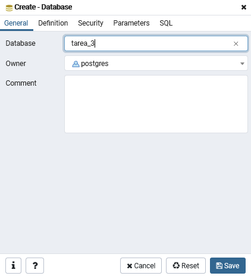
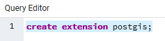
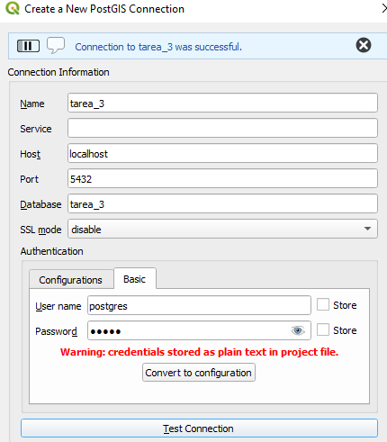
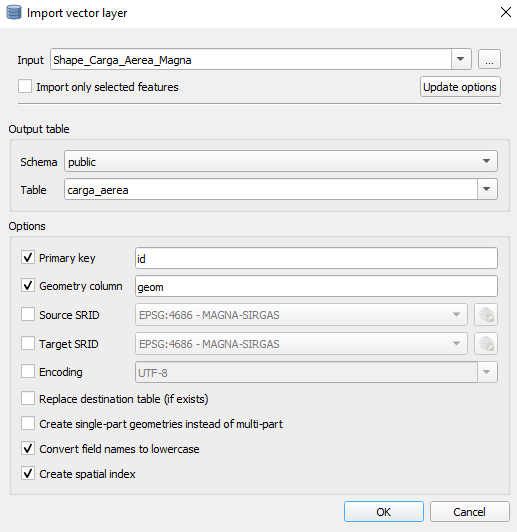
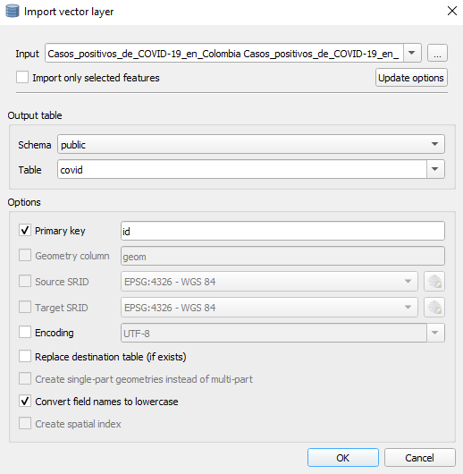
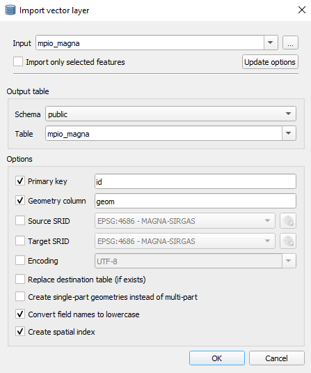

# Tarea 3 - 3101478

# 1. Definición del problema y fuentes de datos

## "Comportamiento del transporte aéreo en Colombia, a causa de la emergencia generada por la pandemia del COVID-19"

Lo que se busca en este trabajo es mostar como ha sido el comportamiento aéreo desde que se decreto la cuarentena, hasta el dia 30 de abril

El enfoque propuesto fue

#### Boceto

#### Fuentes de datos

* Informe_de_carga_a_rea
Atributos: Fecha, Region, Departamento, Latitud, Longitud, Aeropuerto, Carga Llegadas Nacionales, Carga Salidas Nacionales, Carga Llegada Internacionales, Carga Salidas Internacionales, Vuelos Carga, Vuelos Ambulancia, Vuelos Humanitarios, Total Vuelos, Total Carga Transportada TON, Carga Vuelos Nacionales TON, Carga Vuelos Internacionales TON
Atributos que se tuvieron en cuenta:
Link de descarga https://www.datos.gov.co/Transporte/Informe-de-carga-a-rea/4wwa-qb9a

# Procesamiento de datos

* Primero se debe crear la base de datos

* se procede a activar la extension de postgis

* para cargar los datos a la base de datos debemos hacer uso de la herramienta QGIS, primero se debe hacer la conexion a la base de datos, en la ventana "Browser" damos click derecho a la opcion "PosGIS" y se despliega una herramienta que dice "New Connection..." esto despliega una ventana que nos permitira conectar a la base de datos anteriormente creada y se llena de la siguiente manera

* en la ventana de "DB Manager" se selecciona el boton "Import/Layer File..." y se importa los shape y la tabla de la siguiente manera

* 
