# Tarea 3 - 3101478

# Definición del problema y fuentes de datos

## "Comportamiento del transporte aéreo en Colombia, a causa de la emergencia generada por la pandemia del COVID-19"

Lo que se busca en este trabajo es mostar como ha sido el comportamiento aéreo desde que se decreto la cuarentena, hasta el dia 30 de abril

El enfoque propuesto fue

#### Boceto

#### Fuentes de datos

* Informe_de_carga_a_rea
    - Atributos: Fecha, Region, Departamento, Latitud, Longitud, Aeropuerto, Carga Llegadas Nacionales, Carga Salidas Nacionales, Carga Llegada Internacionales, Carga Salidas Internacionales, Vuelos Carga, Vuelos Ambulancia, Vuelos Humanitarios, Total Vuelos, Total Carga Transportada TON, Carga Vuelos Nacionales TON, Carga Vuelos Internacionales TON
    - Atributos que se tuvieron en cuenta: Aeropuerto, Carga Llegadas Nacionales, Carga Salidas Nacionales, Carga Llegada Internacionales, Carga Salidas Internacionales, Vuelos Carga, Vuelos Ambulancia, Vuelos Humanitarios, Total Vuelos, Total Carga Transportada TON, Carga Vuelos Nacionales TON, Carga Vuelos Internacionales TON, Fecha
    - Link de descarga: https://www.datos.gov.co/Transporte/Informe-de-carga-a-rea/4wwa-qb9a

* Municipios
    - Atributos: Codigo departamento, Nombre departamento, Codigo Municipio, Nombre municipio, Codigo DANE
    - Atributos que se tuvieron en cuenta: Nombre municipio, Codigo DANE
    - Link de descarga: https://sites.google.com/site/seriescol/shapes

* Casos Positivos COVID-19
    - Atributos: fecha notificacion, divipola, ciudad, departamento, atencion, edad, sexo, tipo, estado, pais procedencia, inicio sintomas, fecha de muerte, fecha de diagnostico, fecha recuperado, fecha reporte web
    - Atributos que se tuvieron en cuenta: divipola, ciudad, tipo, estado,
    - Link de descarga: https://www.datos.gov.co/Salud-y-Protecci-n-Social/Casos-positivos-de-COVID-19-en-Colombia/gt2j-8ykr/data

# Procesamiento de datos

* Primero se ajustaron los datos ya que venian en csv, se editaron y se guardaron como libro de excel, y posteriormente se cargaron en ArcGis, y se convirtieron en shape. 

* Luego se crea la base de datos

* se procede a activar la extension de postgis

* para cargar los datos a la base de datos debemos hacer uso de la herramienta QGIS, primero se debe hacer la conexion a la base de datos, en la ventana "Browser" damos click derecho a la opcion "PosGIS" y se despliega una herramienta que dice "New Connection..." esto despliega una ventana que nos permitira conectar a la base de datos anteriormente creada y se llena de la siguiente manera

* en la ventana de "DB Manager" se selecciona el boton "Import/Layer File..." y se importa los shape y la tabla de la siguiente manera

* ya podemos trabajar con los datos en postgres

* ya que los datos de carga aerea solo tiene datos del 25 de marzo de 2020 al 30 de abril de 2020, vamos a crear una tabla de los datos de la tabla covid, para solo los casos que se notificaron antes del 1 de mayo de 2020

* eso nos deja con que hasta esa fecha solo se han notificado 8569 casos

* ahora vamos a realizar una union de los datos de la tabla "covid_ant_mayo"con los municipios por el codigo de divipola para darle espacialidad a los datos de covid

* se obtiene que espacializo los 8569 casos

* ahora vamos a depurar los datos de "carga_aerea" 
* al comienzo teniamos 2584 registros, pero muchso registros no tenian informacion, entonces se hizo el filtro por total de vuelos y total carga transportada por toneladas

* eso nos deja un total de 787 regitros para nuestro analisis

* Para la publicacion en GeoNode, En QGIS se procesaron los datos para agruparlos por categoria, esto ya que no se podia hacer una serie temporal. Lo que se muestra en la siguiente imagen, se realizo con todos los campos.

* Luego se hizo un dissolve para agrupar los datos por aeropuerto

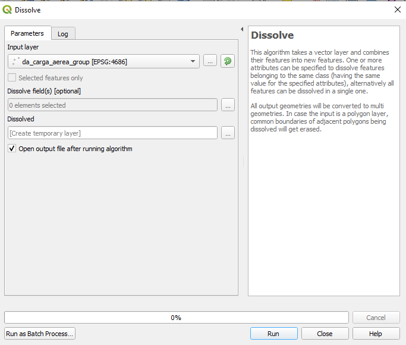

## Carto

* para cargar los datos a Carto, se deben tener en determinados formatos

* se cargo desde la base de datos en la que se venia trabajando a QGIS, en QGIS se verifica los tipos de datos de los atributos y se hacen los cambios necesarios, por ejemplo para este shape se corrigio agrego un nuevo campo fecha, ya que el shape lo tomaba como un string, y desde arcGIS se modifico ese campo 

* posteriormente dandole click derecho sobre la capa se busca la opcion "Export" donde se despliega otra columna y se selecciona la opcion "Save Features As..."

* se escoge el formato GeoJSON y la ruta para guardar y el sistema de referencia, de la siguiente manera

* en la pagina de carto, se busca la opcion "New dataset" y se da click

* se selecciona la ventana "UPLOAD" y se arrastra el archivo de formato tipo GeoJSON a donde indica y se da click en upload dataset

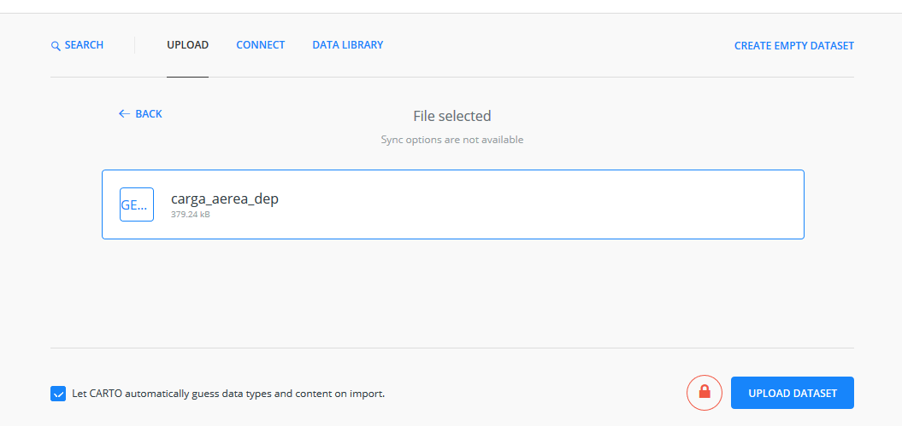

* debe salir el siguiente mensaje 

* en la edicion de la representacion de la capa carga aerea se escoge la pestaña "Style", y en el item 1, se escoge "Aggregation", en el item 2, se escoge el tamaño del punto (Point Size) y se selecciona la opcion por valor (by Value) y se escoge el atributo para la representacion que va a ser total de vuelos (t_vuelos), el segundo estilo que se escoge es el color punto (point color) en este tambien se selecciona la opcion by value, y se escoge la categoria aeropuerto, y se escoge una paleta de diferentes colores ya que son datos categoricos. 

* tambien se activa la opcion etiquetas (labels) y se escoge el atributo para la etiqueta la fuente, el tamaño de la fuente, el color de la fuente y el halo

* ahora se prosigue a activar la opcion de menu al usar el mouse. En la ventana "Pop-Up" se selecciona la opcion "Click light" y se escoge el estilo y se escogen los atributos que se van a mostrar y se ajustan los nombres, de la siguiente manera

* de tal manera que al dar un click se muestre lo siguiente

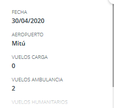

* despues en la pestaña "legend" se escoge la opcion de "Category Legend"

* y obtenemos la siguiente leyenda

* Ahora configuramos los "Widgets", para iniciar un nuevo "Widget", damos click en la pestaña "Widget" y en el boton "Add new widget" 

* se escoge la categoria "Time-Series" y se escoge el atributo para usar, que en este caso es "fecha_" y se da click en el boton "Continue"

 
* y se configura de la siguiente manera

 
 * y el "Widget" nos queda de la siguiente manera, se dejo de manera didactica, para que el ususario pueda escoger las fechas que quiere ver.

 
 * y asi se realizan varios "Widgets" para que el usuario pueda interactuar con la informacion.

 * aca tenemos el dashboard Resultante

 https://danielavendano.carto.com/builder/00bc014e-981c-4f38-9ed7-0b71c6db08d8/embed

## Geonode

* para cargar datos a "Geonode" debemos registrarnos en la pagina o iniciar sesion si ya nos hemos registrado.

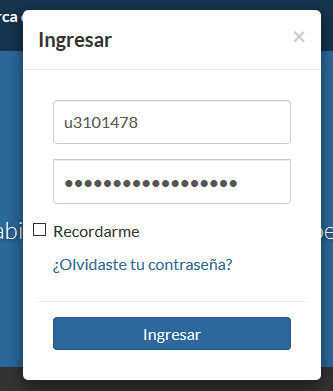

* con el fin de poder subir la capa, nos dirigimos a la pestaña "Data" y dando click se despliegan las siguientes opciones y debemos seleccionar la opcion "Subir Capa"

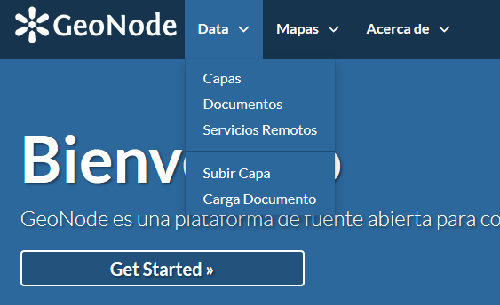

* debe salir una vista asi, arrastramos el archivo hacia la seccion que dice "Colocar los archivo aquí"

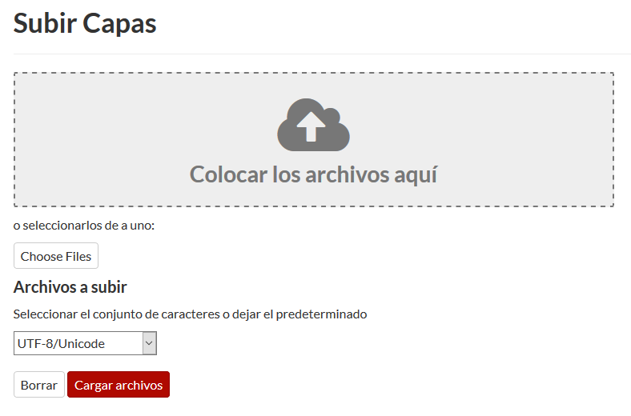

* y damos click en el boton "Cargar Archivos", y nos debe salir lo siguiente 

* posteriormete se puede crear una simbologia desde QGIS y guardar como sld

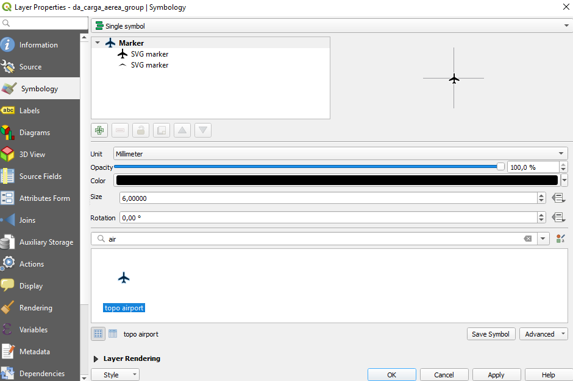

* Luego de cargar la capa, la buscamos y damos click, para quedar en la siguiente ventana

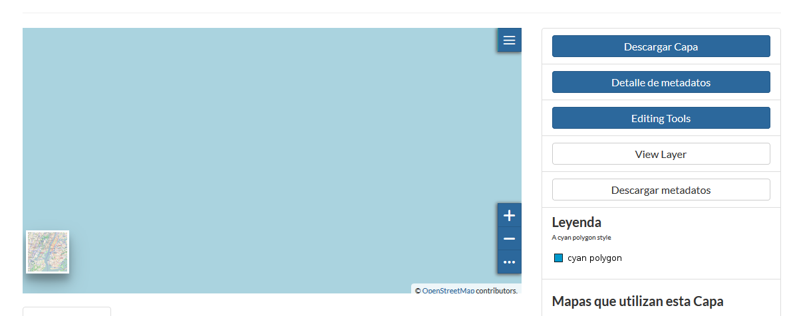

* Damos click al boton "Editing Tools" y en la columna Estilos, buscamos el boton "Upload" y damos Cick, nos debe salir la siguiente pagina

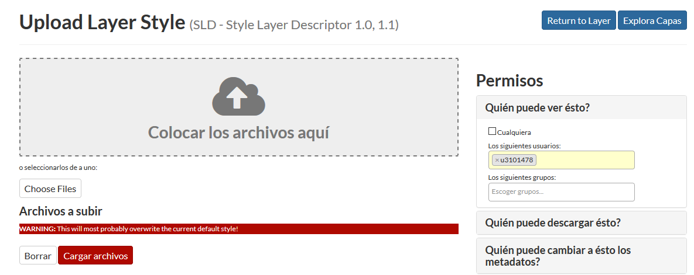

* Arrastramos los datos y le damos click al boton cargar.

* Ahora nos dirigimos a la pestaña Mapas y damos click en explorar mapas, y ahi buscamos la opcion "Create Map", en la parte izquierda se muestra un boton para añadir capas, y damos click ahi.

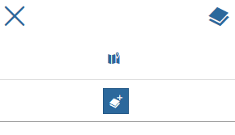

* y ahi buscamos la capa que ya hemos cargado. y dandole click se despliegan una serie de opciones.

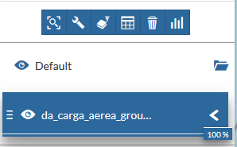

* Damos click al boton de "Widget" y nos despliega las siguientes opciones

 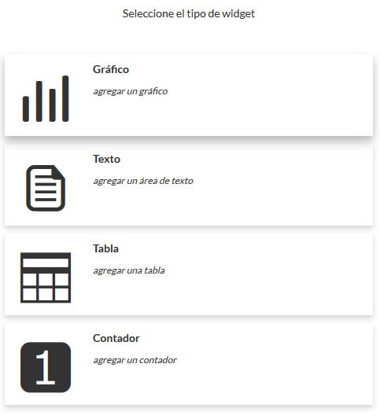

* se escogen los atributos 

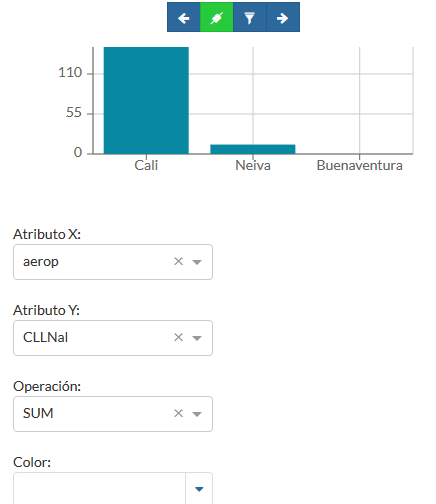

* podemos aplicar un filtro que nos muestre los aeropuertos cuya carga es diferente de cero, esto nos garantiza que en el widget solo esten los aeropuertos que tuvieron ese atributo.

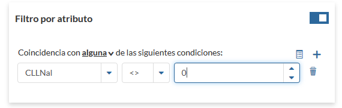

* Se ajusta titulo y descripcion y damos click en Guardar

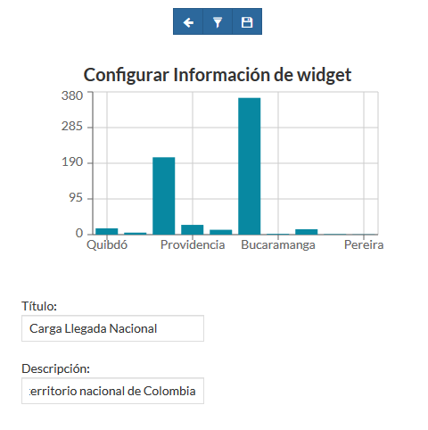

* estre procedimiento, se realizo para los cuatro widgets, quedando de esta manera, ante la limitacion de los colores de los widgets en Geonode, se escogio que los colores azules van a representar comportamiento de caracter nacional, y los verdes de caracter internacional.

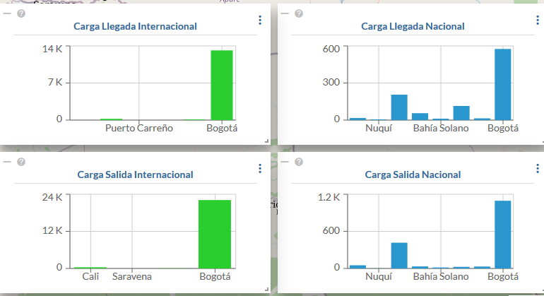

* y aca mostramos el dashboard resultante

http://34.83.176.208/maps/31/view

